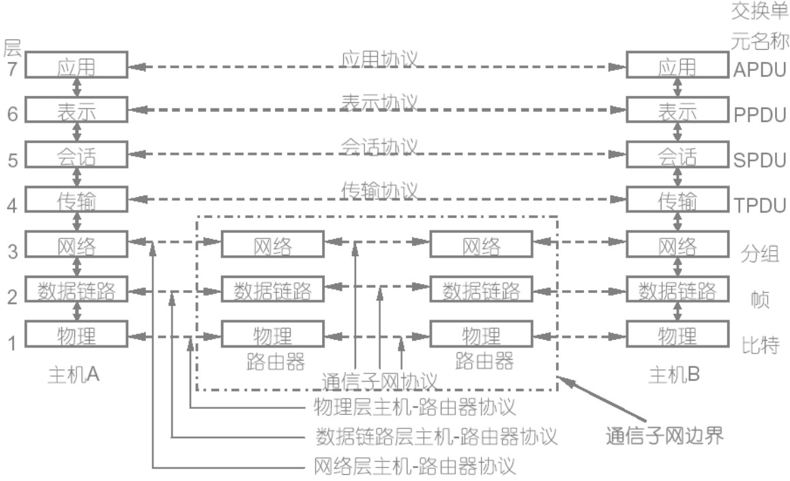
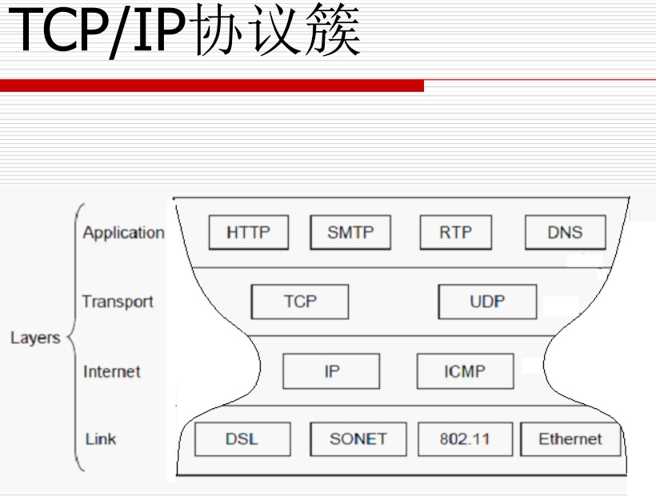
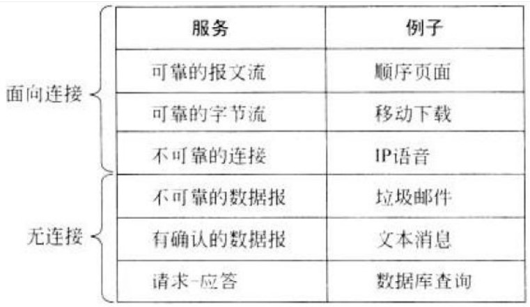

<!--more-->
<!-- more -->

# 计算机网络概述

&emsp;&emsp;说起计算机网络，那么就要弄清楚三个基本概念：

* **计算机网络（computer networks）**：通过单一技术相互连接的自主计算机集合
* **因特网（Internet）**：有两种指代：一是计算机网络的相互联结（网络的网络）；一是全球性互联网络，采用 TCP/IP 协议。为了区分，一般前者用小写的 internet 指代。
* **万维网（WWW，World Wide Web）**：是信息资源的网络，**资源、资源标识和传输协议**三部分支撑 WWW 的运作。

&emsp;&emsp;要形成计算机网络，就必须要有三个条件：一是要有两个或以上的计算机系统，二是这两个系统要通过某种通道相互连接，三是要遵循某种约定从而实现信息交换。下面就从这三点，聊聊计算机网络的构成。

&emsp;&emsp;计算机网络不仅仅包含计算机，还包含手机、平板等设备，我们将这些连接到互联网的设备称为 **主机（host）** 或 **端系统（end system）**

&emsp;&emsp;端系统通过 **通信链路（communication link）** （可理解为信息传输的轨道）和 **分组交换机（packetswitch)**（可理解为轨道相交的车站）连接到一起。

&emsp;&emsp;但光连在一起还不够，我们需要用一定的 **协议** 才能交换信息。就像我们聊天一样，一个人问 “几点了”，那么另一个人就会回答 “23:44”，如果回答“我在宿舍”，那显然就没遵守协议。计算机也是如此。

&emsp;&emsp;我国的互联网主要有下面几个：

* 中国电信 ChinaNet
* 中国移动 CMNET
* 中国联通 UNINET
* 中科院 CSTNET
* 国防部 CGWNET
* 教育部 CERNET

&emsp;&emsp;其中，华南理工大学是华南地区教育网的节点（但我依然想吐槽网速慢）

# 网络的基本概念

## 网络的参数

数字带宽：指在单位时间内流经的信息总量。带宽的单位为：bps、kbps、Mbps、Gbps，单位之间的进制为 $10^3$，注意区分存储中用的 $2^{10}$ 进制的 B、KB、MB、GB。

吞吐量（Throughput）：指实际的、可测到的带宽，取决于：网络设备、传输的数据类型、网络拓扑、用户数量等

延时：

1. 传输时延（发送时延）：
   发送数据时，数据块从结点进入到传输媒体所需要的时间。也就是从发送数据帧的第一个比特算起，到该帧的最后一个比特发送完毕所需的时间。 
2. 传播时延：
   电磁波在信道中需要传播一定的距离而花费的时间。 信号传输速率（即发送速率）和信号在信道上的传播速率是完全不同的概念。 
3. 处理时延：交换结点为存储转发而进行一些必要的处理所花费的时间。
4. 排队时延：结点缓存队列中分组排队所经历的时延。排队时延的长短往往取决于网络中当时的通信量。

注：排队延迟是节点延迟中最复杂、也是最有趣的部分。之所以最有趣，指目前或多研究工作就是针对排队延迟来进行的，包括调度算法、缓存策略等。 排队延迟与网络设备的负载状况密切相关，不同分组所经历的排队延迟会随着负载的变化而变化

关于发送延迟和传播延迟，容易弄混。需要记住，传输延迟指将一个分组所有bit发送到link上所需的时间，与分组长度和发送速率有关，与两点之间的距离没有任何关系。而传播延迟指一位从链路的一端传播到另一端所需的时间，与link的长度和信号的传播速度有关。

## 网络的分类

按拓扑结构（信道的分布方式）分：

1. 总线型
2. 星型
3. 环型
4. 树型
5. 网状

网络按规模（传输距离）从小到大分为：

1. 个域网 PAN Personal area networks
2. 局域网 LAN Local area networks
3. 城域网 MAN Metropolitan area networks
4. 广域网 WAN Wide are networks
5. 互联网 Internet

按传输介质分：

1. 有线网
2. 无线网

## 网络协议

协议：一系列规则和约定的规范性描述，它控制网络中的设备之间如何进行信息交换。

网络协议的三个要素：
1. 语法：数据与控制信息的结构或格式
2. 语义：控制信息，指出完成的动作及响应
3. 同步：事件执行顺序的详细说明

协议分层的优点：

1. 各层工作独立，层之间通过接口联系，降低
协议工作的复杂程度
2. 灵活性好，任何一层的改变不影响其它层
3. 每层的实现技术可以不同，减少了实现的复
杂度
4. 易于维护，每层可以单独进行调试
5. 便于标准化

## 网络分层与协议分层

分层的意义

1. 网络互联的自然需求
2. 分而治之，简化网络操作
3. 提供即插即用的兼容性和不同厂商之间集成的标准
4. 使工程师们可以专注于某一功能模块的设计和优化
5. 防止不同区域网络之间的相互影响。

网关（Gateways）的作用：
* 连接异构网络
* 提供必要的转换（软件或硬件）

---

分层原则：信宿机第n层收到的对象应与信源机第n层发出的对象完全一致。“对象”的专业术语叫 **PDU（Protocol Data Unit）协议数据单元**

典型分层模型：

* OSI七层模型（如下图）
* TCP/IP（DoD）四层模型：只有数据链路层、网络层、传输层、应用层

<!--  -->

<!--  -->

OSI模型和DOD模型比较：
* 相同点
   * 都分层
   * 都有应用层，尽管他们的服务不同
   * 都有可比较的传输层和网络层
   * 使用的分组交换而不是电路交换技术
* 不同点
   * TCP/IP将表示层和会话层包含到了应用层
   * TCP/IP将OSI的数据链路层和物理层包括到了一层中
   * TCP/IP更简洁，但OSI更易开发和排除故障
   * TCP/IP在实践中产生

## 网络的连接方式

两种连接：
* 点到点：信源机和信宿机之间的通信由一段一段的直接相连的机器间的通信组成，机器间的直接连接叫做点到点连接。
* 端到端：信源机和信宿机之间直接通信，好象拥有一条直接的线路。由多段点到点的连接组成

服务采用的连接：
1. 面向连接的服务: 电话(circuit)
2. 无连接的服务: 电子邮件Email(packet)

<!--  -->

交换技术：“交换”(switching)就是按照某种方式动态地分配传输线路的资源。

1. 电路交换： 在通信进行过程中，网络为数据传输在传输路径上预留资源，这些资源只能被这次通信双方所使用；
2. 分组交换：数据被分成一个一个的分组，每个分组均携带目的地址，网络并不为packet传输在沿途packet switches上预留资源，packet switches为每个packet独立确定转发方向.
与电路交换不同，链路、交换机/路由器等资源被多个用户所共享，交换机在转发一个分组时的速度为其输出链路的full速度。
   注：分组交换一般采用存储转发技术，分组在分组交换机中会经历一个排队(queuing)延迟。排队延迟与交换机的忙闲有关，大小可变。 如果分组到达时缓存已满，则交换机会丢掉一个分组。分组交换网络有两大类1、Datagram（数据报)网络2、Virtual Circuit虚电路网络
3. 报文交换：将形成的报文发送给结点交换机，结点交换机把收到的报文存储并送输入队列等待处理。结点交换机再依次对输入队列中报文做适当处理，然后根据报文头中的目的地址选择适当的输出链路。若链路空闲，便将报文发送下一个结点交换机；若输出链路正忙，则将报文送该链路的输出队列等待发送。这样，通过多次转发直至报文到达指定目标。

# 本章中重要的中英文对照

* Internet：因特网
* Reference model：参考模型
* PDU（Protocol Data Unit）：协议数据单元
   * Bits：比特流
   * Frame：帧
   * Packet：分组
   * Segment：数据段
* RFC（Request for comments）：请求注释文档（定义互联网标准的文档）
* Encapsulation:封装
* Peer To Peer Communication（virtual communication）：对等通信（虚拟通信）