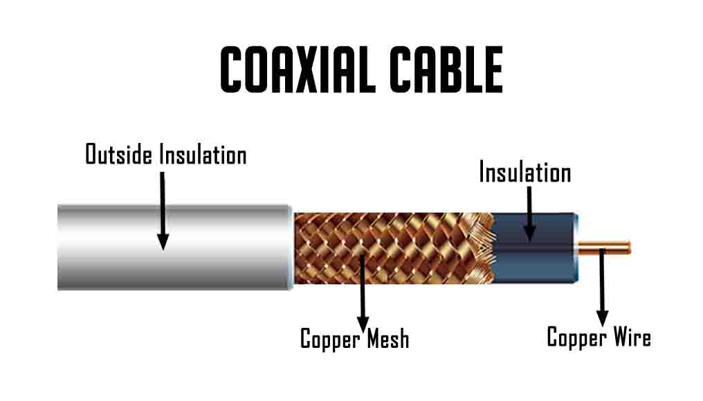
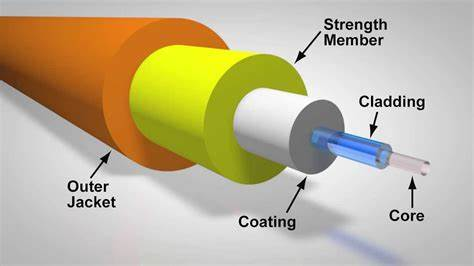

<!--more-->
<!-- more -->

# 物理层概述

&emsp;&emsp;**物理层** 的主要功能是提供透明 [^1] 的比特流传输，它定义了比特作为信号在信道上发送时的相关的电气、时序、接口。我们主要关注以下4个特性：

* 机械特性：接口的形状、尺寸、引脚、排列等
* 电气特性：接口上的电压范围
* 功能特性：某一电平所表示的意义
* 规程特性：不同功能的各种可能事件出现的顺序（类似协议）

# 数据通信基础理论

&emsp;&emsp;信号在传输的过程中，不可避免地会发生衰减，一般在 $0\sim f_c$ 频率范围内信号不会衰减，$f_c$ 称为 **截止频率**。频率范围不一定从0开始，可以是任两频率 $f_1 \sim f_2$ 之间。我们把这个宽度称为 **带宽**，或 **物理带宽** 或 **模拟带宽**，单位为 Hz。

&emsp;&emsp;与模拟带宽对应的是 **数字带宽**，指单位时间内流经的信息总量，单位为 bps。

&emsp;&emsp;模拟带宽与数字带宽之间通过**奈奎斯特定理**联系：

$$
最大传输速率 = 2B \log_2 V\\
B: 模拟带宽 \quad
V：离散等级（采样等级）
$$

离散等级指的是采样后，模数转换能得到多少种数字。比如，用 16 比特采样，那么离散等级为 $2^{16}$，做题时要注意

&emsp;&emsp;但上面只是理想情况，实际还要考虑噪声的能量，即信噪比（SNR，Signal-to-Noise Ratio），考虑 SNR 后得到**香农公式**：

$$
最大传输速率 = B \log_2 (1+S/N)\\
B: 模拟带宽 \quad
S/N：信噪比
$$

&emsp;&emsp;信噪比常用分贝来表示：$10\lg \frac{S}{N}$，做题时要注意换算。

---

补充：数字带宽有时候也叫信道容量、传输速率，指的是每秒可以通过的比特。后面我们还会学一个概率叫“来回时间”，指的是数据从 A 发到 B 再发回 A 的时间。这两个概念是完全不同的。我们可以把传输速率看作流量，把来回时间看作流速。

[^1]: 透明：实现方式对上层不可见。

# 传输介质

&emsp;&emsp;传输介质分为：

* 引导性介质（有线）
  * 铜线
    * 双绞线
    * 同轴电缆
    * 电力线
  * 光纤
* 非引导性传输介质（无线）
  * 无线电
  * 卫星

&emsp;&emsp;我们主要关注的是传输介质的传输距离、带宽、延迟、成本、安装与维护的难易程度。下面来具体讨论。

## 引导性传输介质

### 同轴电缆 Coaxial Cable

<!--  -->

* 组成（由内到外）：铜芯、绝缘材料、编织外层导体、保护塑料外套
* 分类：
  * 按屏蔽层分：
    * 铜：基带同轴电缆50Ω，用于数字传输
    * 铝：宽带同轴电缆75Ω，用于模拟传输
  * 按粗细分：
    * 粗缆：最大传输距离 500 米，两端安装终结器，以保证电缆屏蔽层接地
    * 细缆：最大传输距离 185 米，两头安装BNC头，接在T型连接器两端
* 特点：
  * 同轴电缆的结构使其具有高带宽与很好的抗噪性
* 用途：有线电视、城域网

### 双绞线 Twist Pair Cable

<!--  -->

* 组成：由两根具有绝缘层的铜导线按一定密度，逆时针方向绞合而成。
* 分类：（后面会有更详细的介绍）
  * 非屏蔽双绞线（UTP，Unshielded Twisted Pair）：无屏蔽层，百兆带宽，传输距离百米，用于局域网。
  * 屏蔽双绞线（STP，Shielded Twisted Pair）：每对线外、所有线外有屏蔽层
  * 网屏式双绞线（ScTP：Screened Twisted Pair）：所有线外有屏蔽层
* 特点：
  * 通过绞合消除了串扰 Crosstalk，而且绞距越小越均匀，抵消效果越好

### 光纤 Optical Fibre

* 组成：玻璃芯、玻璃覆盖层、塑料封套
* 分类：
    * 单模光纤：只允许一个方向的光通过，传输距离更远，带宽更大
    * 多模光纤：可容许不同模式的光于一根光纤上传输
* 特点：
    * 优点：优点：重量轻、损耗低、不受电磁辐射干扰、传输频带宽、通信容量大、防窃听
    * 缺点：昂贵、易断裂
    
## 无引导性介质

根据电磁波的频谱来划分。

### 无线电

### 微波

### 红外

### 卫星

# 数字调制

将比特转换为物理信号的过程称为 **数字调制（digital modulation）**，根据物理信号所占的频率可分为：

* **基带传输**：占据从0到最高频的频率
* **通带传输**：占据以载波为中心的一段频率

波特率（符号率、采样率）：每秒钟信号变化的次数

比特率（位传输率、数据传输速率）与波特率的关系:

$$
C=B \log_2 n
$$

其中：C：比特率； B：波特率； n：调制电平数或线路的状态数，一般为2的整数倍（P99，有例外）。

## 基带传输

&emsp;&emsp;最简单的方式就是用正电压表示 1，负电压表示 0，这种编码方案称为 **不归零编码（NRZ, Non-Return-to-Zero）**，根据奈奎斯特定理，至少要 $B/2$ Hz 带宽才能获得 $B$ bps 的比特率。要提高比特率，可以提高带宽，或增加信号等级。NRZ 需要时钟来确定一个符号的开始与结束的位置（否则当有一长串0或1时，可能会漏比特）。

&emsp;&emsp;为了节省时钟线，可以采用 **曼彻斯特编码（Manchester）**：将时钟与电压进行异或，当从低到高跳变表示 0，从高到低跳变表示 1. 但由于存在时钟，需要 NRZ 两倍的带宽。

&emsp;&emsp;实际上我们并不需要全部的时钟，我们只需要某些“标识”用于对齐即可。于是就有了 **不归零跳转（NRZI, Non-Return-to-Zero）**：信号跳变定为 1，信号不变定为 0。这样就能解决 1 的对齐问题。

&emsp;&emsp;但 NRZI 在一大串 0 时依然有问题，于是又有了 **4B/5B编码**：将 4 个比特映射到 5 个比特上，避免出现连续的 3 个 0。映射方法见下表。这种编码增加了 25% 的带宽开销，但至少比曼彻斯特编码好。

## 通带传输

我们可以利用载波信号的幅度、频率、振幅来调制，也就是：

* 幅移键控（ASK）：利用信号的振幅表示 0 和 1
* 频移键控（FSK）：利用信号的频率表示 0 和 1
* 相移键控（PSK）：利用信号的相位表示 0 和 1

&emsp;&emsp;我们可以同时利用多个相位来进行调制。上图中只用到了 0° 和 180°，故称为 **二进制相移键控（BPSK）**；如果利用 45°、135°、225°、315°，则称为 **正交相移键控（QPSK）**。

&emsp;&emsp;进一步的，我们可以同时用三者中的两个来进行调制。一般常用的是相位和幅度，称为 **正交调幅（QAM, Quadrature Amplitude）**。可以用星座图来表示，图中每个点是一个符号，点到原点的距离为幅度，与 x 轴正半轴的夹角为相位。比如下图中的 QAM-16，QAM-64。为了减小错误率，常采用格雷码对每个点进行编号（这样即使错误地采到了旁边的点也只是有一位错误）。

为了降低高速调制错误，在每个样本中采用一些额外的位用作纠错，剩下的位才用来传输数据，这种机制叫**格子架编码调制TCM (Trellis Coded Modulation).**，比如：

* 在 V.32调制标准中，波特率是2400，采用了QAM-32，每码元传输5个比特，但其中的1个比特用来做奇偶校验，所以，数据传输率只有9600bps。
* 在 V.32bis标准中，采用了QAM-128（27），传输速率达14,400 bps ，有一个比特用来纠错。

# 多路复用

&emsp;&emsp;一条线路的带宽是很大的，如果只用于传输一个信号就会很浪费，所以一般会传输多个信号。这就叫 **多路复用**。常见的复用方法有：

* 频分复用（FDM）：不同信号在不同频段上，后来发展成了 OFDM（正交FDM）。
* 波分多路复用（WDM）：本质跟 FDM一样,在光纤上复用信号
* 时分复用（TDM）：每个信号周期性地获得整个带宽一小段时间，后来发展成了 STDM （统计时分多路复用）
* 码分复用（CDM 或 CDMA）：每个信号可以用整个频段发送信号，且无时间限制，但信号必须遵循一定规则

&emsp;&emsp;码分复用是最有趣的，每个信号都有一个特定的 **码片序列**，如果要发送 1，则发送码片序列；0 则发送码片序列的反码。比如有 4 个信号，每个信号有一个 4位码片序列：

* $A：+1+1+1+1$
* $B：+1+1-1-1$
* $C：+1-1+1-1$
* $D：+1-1-1+1$

&emsp;&emsp;这 4 个序列两两正交，比如：$A\cdot B=0$。信号同时发送时，进行线性叠加：$A+\overline{B}+C=+1-1+3+1$。接收方只需要乘以对应的码片序列，就能解码出信号：$A\cdot(A+\overline{B}+C)=4$，$B\cdot(A+\overline{B}+C)=-4$，$C\cdot(A+\overline{B}+C)=4$

# 物理层部件和设备

* 被动部件/设备：
  * 接线板（patch panel ）
  * 插头（plug）
  * 插座 (jack)
  * 电缆 （f.g. CAT-5）
* 主动部件/设备：
  * 转发器（transceiver）：将一种形式的信号转变成另一种形式
  * 中继器 (repeater)：再生信号，让线缆可以延伸得更远，不能过滤流量
  * 集线器 (hub)：多端口的中继器，用于放大和再生信号，作为星型拓扑的中心，允许很多设备连接到一个集线器上

冲突域：数据包产生和冲突的网络区域，即指共享媒质区。hub 和 repeater 都会使得冲突域扩大，要减小冲突域，要使用 Bridge、LAN Switch、Router。

# PSTN

&emsp;&emsp;拨号上网使用的网络就是：公共交换电话网络（PSTN： Public Switched Telephone Network ），它的主要构成及技术有：

* 本地回路（连接端局到家庭的模拟线路）：调制技术，数模/模数转换。完成这个工作的机器称为调制解调器（Modem），俗称猫
* 干线（连接交换局的数字光纤）：复用技术
* 交换局（包括端局，话音接驳干线的场所）：

---

PSDN 的最高速率受制于调制解调器，最高为 56kbps （V.90 标准）. 因为电话线路的带宽为 4kHz，采样率为 8kHz，每个码元传输 8bit，其中一个 bit 用于控制错误，故传输速率为 8k*7=56kbps，毛速率为 64kbps

之所以有 4kHz 的带宽限制，是因为有个滤波器，如果取消这个滤波器，就能使用全部 1.1 MHz，这种称为 **xDSL**，是各种类型DSL（Digital Subscribe Line，数字用户线路）的总称，包括ADSL、RADSL、VDSL、SDSL、IDSL和HDSL等。

**宽带服务** 在 xDSL 上采用了 G.dmt 标准，允许 8MHz 下行带宽和 1MHz 上行带宽。由于两个带宽不对称，所以称为 ADSL（非对称用户数字线）其中，1 Mhz 带宽分为了 256 个 4k 信道，第一个 4k 信道依然用于电话服务，第二到六信道空闲，后面的信道用于上、下行控制以及数据传输。

现在将电话线换成了光纤，即光纤到户，速度也进一步提高

---

干线一般用的是光纤。因为光纤中传输的是光脉冲（0和1），所以需要用编解码器（codec）将模拟信号转换为数字信号。

codec 使用了 **PCM（Pulse-code modulation），脉冲编码调制** 技术，简单来说就是抽样、量化、编码。经过 PCM 后，再用 TDM 复用技术来发数据。这里有两个标准（计算方法见PPT）：

* T1 的速率是1.544Mbit/s
  * T1 线路可处理24路信号的复用： 24 x 8 = 192 bits + 1 bit for framing = 193 bits/frame
  * 话音信道的采样率是每秒8000次 ，那么传递TDM复用帧的时间间隔需要 1/8000 sec = 125微秒
  * 所以，T1 线路的传输速率是: 193 bits / 0.000125 seconds = 1.544 Mbps
* E1 的速率是2.048Mbit/s
  * E1可处理 32条语音的复用 ：32 x 8 =256bits/frame
  * 话音信道的采样率是每秒8000次 ，那么传递TDM复用帧的时间间隔需要 1/8000 sec = 125微秒
  * 所以，T1 线路的传输速率是: 256 bits /0.000125 seconds = 2.048 Mbps

除了简单的 TDM 外，还有一种复杂的 TDM 叫 SONET/SDH（同步光网络），它的基本帧结构是这样的：

* 9(行) x 90(列) = 810字节（注意单位！！ 1byte=8bits）
* 头3列 用于系统管理信息
* 其余的87 列包括用户数据，即同步载荷封包 SPE(Synchronous Payload Envelope)，其中的第1列又用于路径开销。

有效数据（装在 **SPE，同步有效载荷信封** 中）可以从帧的任何一个地方开始，甚至可以跨帧（见下图）

因为传输是同步的（通过帧的前两个字节同步），所以即使没有数据也要发空帧。帧的发送速率为 8000 帧/s，故速率为：

* 总传输速率：8×810×8000==51.84 Mbps
* SPE 速率为 8×9×87×8000=50.112 Mbps
* 用户数据：8×9×86×8000=49.536 Mbps

以上是基本的 SONET，称为 **STS-1 或 OC-1**。随着传输速率提高，可以进一步复用。若 n 条复用，则称为 **STS-n 或 OC-n**，响应的传输速率就提高 n 倍。

如果后面加上 C，如 OC-12C，就表示复用的信号来自同一个源，因此，只需要一个路径开销，即：段开销和线路开销有12x3列，路径开销仅有 1 列，用户数据总共是 1080-36-1=1043 列，所以用户数据是： 1043x9x8x8000=600.768Mbps

---

交换局中有两种交换方式：

* 电路交换
  1. 建立一条端到端的通路（真实的电路连接）
  2. 传数据
  3. 拆除连接
* 分组交换/包交换：
  1. 每个分组/包大小有限制，可以存在交换局
  2. 每个分组/包携带目的地址、信息，独立寻径。
  3. 乱序到达

对比如下：

||电路交换|包交换|
|--|---|--|
|是否要提前设置|是|否|
|每个包的路径|相同|不同|
|包到达的次序|顺序|乱序|
|带宽|固定，提前分配|动态|
|带宽浪费|有|无|
|容错能力（抗毁性）|弱|强|
|计费|按时间|按流量|